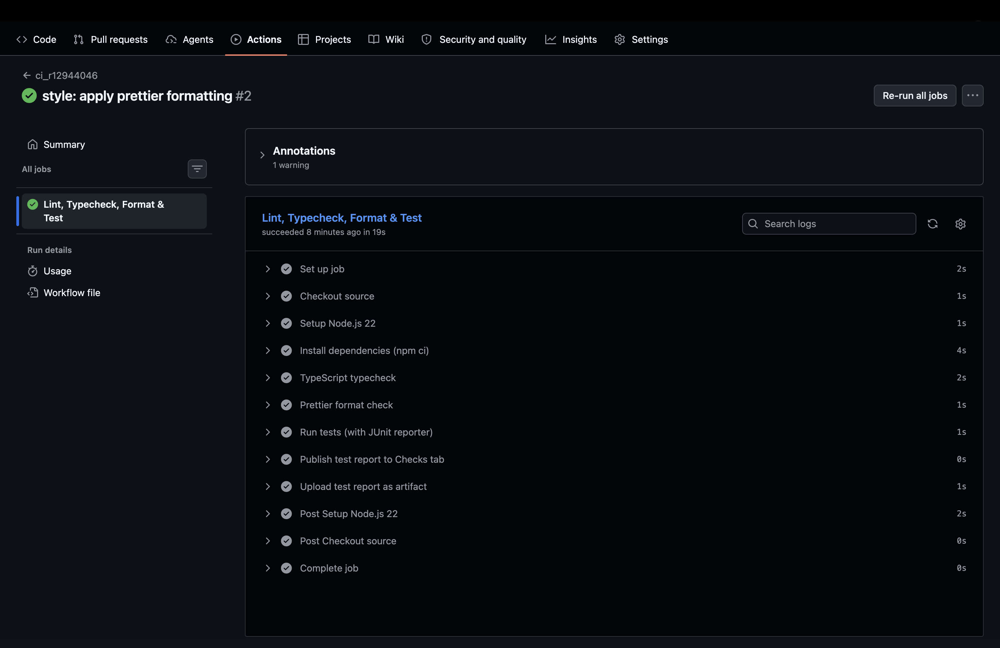
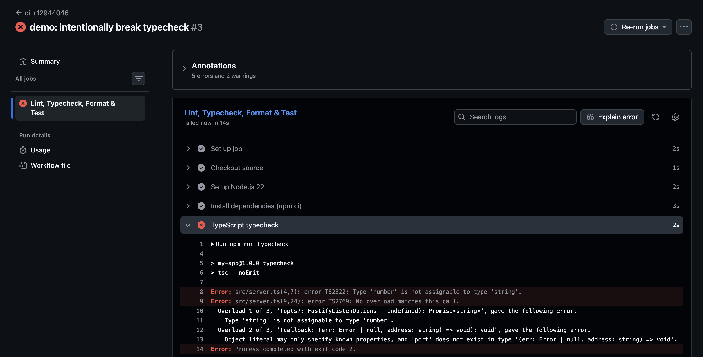

## 作業報告：CI Pipeline 實作（學號 r12944046）

### 1. CI Pipeline 說明

#### Pipeline 設計概覽

本作業在 `.github/workflows/ci_r12944046.yaml` 實作了一條完整的 CI Pipeline，
涵蓋程式碼品質檢查與自動化測試，並將測試結果發布至 GitHub Actions 的 Checks 頁面。

#### Workflow 主要內容

```yaml
name: ci_r12944046

on:
  push:
    branches:
      - '**'
  pull_request:

permissions:
  contents: read
  checks: write
  pull-requests: write

concurrency:
  group: ci-${{ github.workflow }}-${{ github.ref }}
  cancel-in-progress: true

jobs:
  quality-and-test:
    name: Lint, Typecheck, Format & Test
    runs-on: ubuntu-latest

    steps:
      - name: Checkout source
        uses: actions/checkout@v5

      - name: Setup Node.js 22
        uses: actions/setup-node@v5
        with:
          node-version: '22'
          cache: 'npm'

      - name: Install dependencies (npm ci)
        run: npm ci

      - name: TypeScript typecheck
        run: npm run typecheck

      - name: Prettier format check
        run: npm run format:check

      - name: Run tests (with JUnit reporter)
        run: |
          mkdir -p reports
          npm test -- \
            --reporter=default \
            --reporter=junit \
            --outputFile.junit=reports/vitest-junit.xml

      - name: Publish test report to Checks tab
        if: always()
        uses: dorny/test-reporter@v2
        with:
          name: Vitest Results
          path: reports/vitest-junit.xml
          reporter: jest-junit
          fail-on-error: 'true'

      - name: Upload test report as artifact
        if: always()
        uses: actions/upload-artifact@v4
        with:
          name: vitest-junit-report
          path: reports/
          if-no-files-found: error
```

#### Pipeline 設計說明

**觸發條件**

使用 `push: branches: '**'` 萬用字元，讓任何分支的 push 都自動觸發 CI，
同時加上 `pull_request` trigger，方便 reviewer 在 PR 頁面直接看到結果。
`concurrency` 設定在同一個 ref 重複 push 時自動取消前一個尚未完成的 run，節省 Actions minutes。

**品質檢查（三道關卡）**

| 步驟 | 指令 | 說明 |
|------|------|------|
| TypeScript typecheck | `npm run typecheck` → `tsc --noEmit` | 檢查所有型別錯誤，不產生輸出檔案 |
| Prettier format check | `npm run format:check` → `prettier --check .` | 確保程式碼格式與 `.prettierrc` 一致 |
| Run tests | `npm test` → `vitest run` | 執行所有單元測試 |


所有步驟皆未設定 `continue-on-error`（預設 `false`），
任一步驟失敗都會立即讓整個 job 標記為失敗，後續步驟不再執行。

**測試結果發布（兩層策略）**

1. **dorny/test-reporter@v2**：將 vitest 輸出的 JUnit XML 轉換成 GitHub Checks tab 上的互動式測試報告，可直接在 Actions 頁面看到每個測試的通過／失敗狀態。`if: always()` 確保即使測試失敗仍會發布報告。
2. **actions/upload-artifact@v4**：備援方案，將 XML 上傳為 artifact 可供下載，避免 fork PR 因權限限制導致 `dorny/test-reporter` 無法寫入 Checks 時完全看不到結果。

**使用到的現成 Actions**

- `actions/checkout@v5`
- `actions/setup-node@v5`（含 npm cache）
- `dorny/test-reporter@v2`
- `actions/upload-artifact@v4`

---

### 2. CI 執行結果截圖（成功案例）

下圖為 push 後 GitHub Actions 成功執行的結果頁面，
三道品質關卡（typecheck、prettier check、tests）全數通過，
Checks tab 可見 Vitest 的逐筆測試結果。



---

### 3. 失敗案例說明

#### 故意製造 TypeScript 型別錯誤

**Pipeline 失敗原因 與 修正方式**

原本的檔案：

```typescript
const port = Number(process.env.PORT || 3000);
```

將 port 的 type Number寫成 string會造成typescript錯誤： 

```typescript
const port: string = Number(process.env.PORT || 3000);
```

移除錯誤的 `: string` 型別標記，讓 TypeScript 自動推導為 `number`：

```typescript
const port = Number(process.env.PORT || 3000);
```

或顯式標為 `const port: number = ...`，兩種都能通過 typecheck。

**Pipeline 失敗過程**

`npm run typecheck`（`tsc --noEmit`）在 `src/server.ts` 第 4 行偵測到型別不一致，
印出以下錯誤並以 exit code 2 退出，導致整個 job 標記為失敗：

```
> my-app@1.0.0 typecheck
> tsc --noEmit

src/server.ts(4,7): error TS2322: Type 'number' is not assignable to type 'string'.
Error: Process completed with exit code 2.
```


**失敗截圖**

下圖為 pipeline 在 TypeScript typecheck 步驟失敗的 GitHub Actions 結果頁面。

